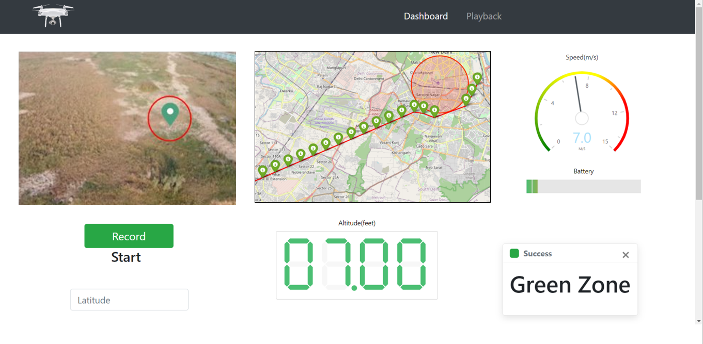

# CSE2003_DSA_Project
## Path Planning for UAVs with a Custom GUI

## Team Mates
* Anshuman Phadke - 19BEC0428
* Saksham Bhutani - 19BEC0559

## Introduction 

Drones are widely used for applications like vaccine delivery, military service and blood delivery. More than 9.6 million drones will be used for such applications by the end of 2030.

The Directorate General of Civil Aviation (DGCA) has released an Airspace Map in the year 2021. Drones used for different applications have to follow a set of rules. These are known as “Drone Laws 2021”. This airspace map demarcates yellow, green and red zones across India.

Every zone has a specific meaning:
•	Yellow: UAVs are allowed to fly over 400ft
•	Red:	UAVs are prohibited from flying over red zones
•	Green:	UAVs are allowed to fly up to 400ft

We are coming up with a solution that provides the shortest path from the source to the destination point following all the zone parameters.

## To run this install the dependencies using
```
pip install -r requirements.txt
```

## To run this use the following command lines
```
python arduino_data.py
python server.py
set FLASK_APP=app.py
flask run
```

## DGCA Map 
<p align="center">
  
 </p>
 
 <br>
 
## Block Diagram 
<p align="center">
  
 </p>
 
 <br>
 
## GUI 
<p align="center">
  
 </p>
 
 <br>
 
 ## Shortest Path Algorithm 
 
 <p align="center">
  
 </p>
 
  <p align="center">
  
 </p>
 
  <p align="center">
  
 </p>
 
  <p align="center">
  
 </p>
 
  <p align="center">
  
 </p>
 
  <p align="center">
  
 </p>
 

